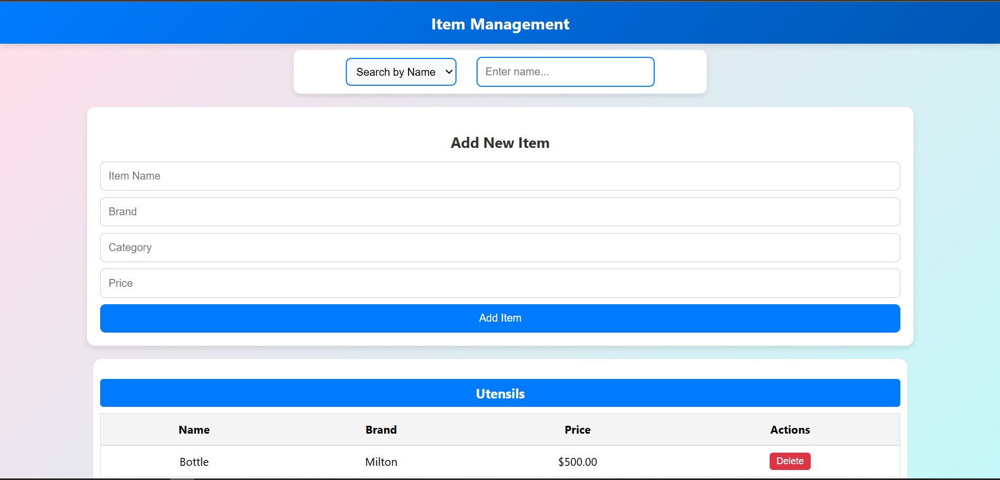
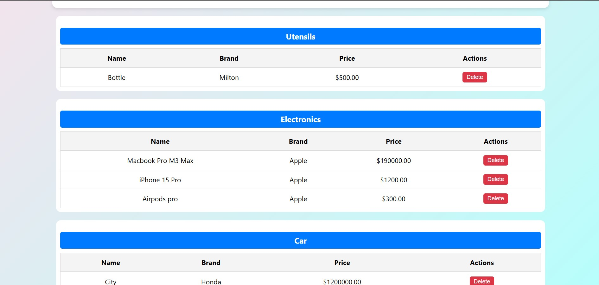
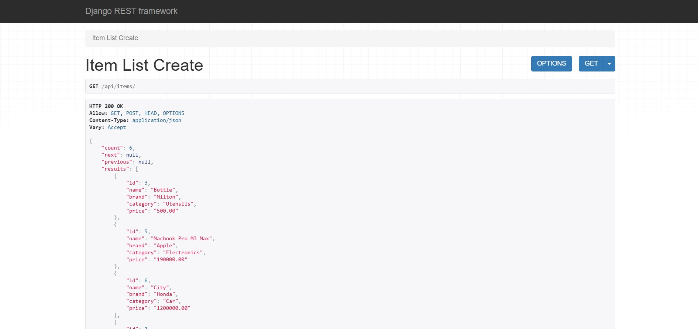

# Items Management

## Overview
This is a full-stack web application for managing items. It allows users to **create, read, update, and delete (CRUD)** items, search for items by name or brand, and group them by category. The project consists of a **Django backend** (with PostgreSQL) and a **React frontend** that consumes the API.

## Features
- **CRUD Operations:** Add, edit, and delete items.
- **Search & Filtering:** Search items by name or brand.
- **Category Grouping:** Items are displayed in categorized tables.
- **Pagination:** Fetches and displays items in pages.
- **Styled UI:** User-friendly and responsive design.

## Tech Stack
### **Backend (Django + PostgreSQL)**
- Django REST Framework (DRF) for API development
- PostgreSQL as the database
- CORS handling for API access

### **Frontend (React + Axios)**
- React.js for UI development
- Axios for API calls
- Flexbox & Grid for layout
- Styled components for UI design

## Setup Instructions

### 1. Clone the Repository
```bash
git clone https://github.com/YourUsername/your-repo.git
cd your-repo
```

### 2. Backend Setup (Django)
#### Install dependencies:
```bash
pip install -r backend/requirements.txt
```
#### Apply migrations:
```bash
python manage.py migrate
```
#### Start the server:
```bash
python manage.py runserver
```

### 3. Frontend Setup (React)
#### Navigate to the frontend directory:
```bash
cd frontend
```
#### Install dependencies:
```bash
npm install
```
#### Start the development server:
```bash
npm start
```

## API Endpoints
| Method | Endpoint | Description |
|--------|------------|-------------|
| GET | /api/items/ | Fetch all items |
| POST | /api/items/ | Add a new item |
| PUT | /api/items/{id}/ | Update an item |
| DELETE | /api/items/{id}/ | Delete an item |

## How to Use
1. **Search Items:** Use the search bar to find items by name or brand.
2. **Add Items:** Fill in the form and click 'Add Item'.
3. **Delete Items:** Click the delete button next to an item.
4. **Pagination:** Navigate through items using the pagination controls.

## Screenshots
 
 
 

